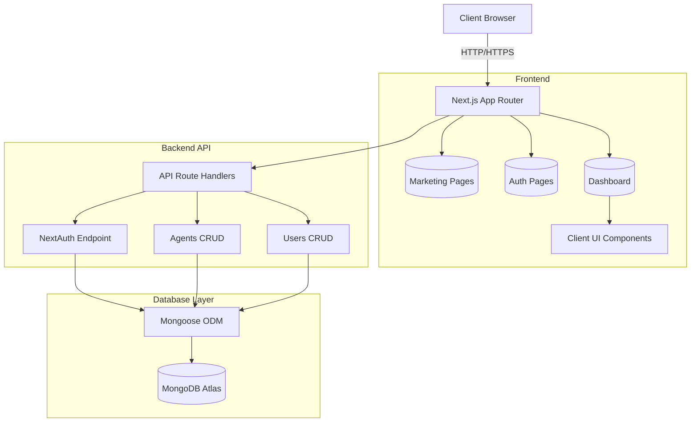

# Architecture Overview

## Architecture Diagram



## Folder Structure

```text
src/
├── app/
│   ├── (marketing)/      # Public landing pages
│   ├── (auth)/           # Login and Registration pages
│   ├── dashboard/        # Protected admin and user dashboard
│   ├── api/              # Backend Next.js Route Handlers
│   └── globals.css       # Global styles (Tailwind V4 configuration)
├── components/
│   ├── marketing/        # Premium UI components for landing page
│   ├── dashboard/        # Sidebar, Topbar, interactive CRUD components
│   └── ui/               # shadcn/ui components
├── lib/
│   ├── mongodb.ts        # MongoDB connection caching logic
│   └── utils.ts          # Tailwind merge utilities
├── models/
│   ├── Agent.ts          # Mongoose schema for Agents
│   └── User.ts           # Mongoose schema for Users
├── auth.ts               # NextAuth v5 configuration
└── middleware.ts         # Route protection and role-based redirect logic
```

## Authentication Flow
The application uses NextAuth v5 (Auth.js) with the Credentials provider.
1. Users submit credentials via `LoginForm`.
2. `signIn` calls the NextAuth configuration in `src/auth.ts`.
3. The server connects to MongoDB, hashes the input via `bcrypt`, and compares it to the stored hash.
4. On success, a JWT session is created, injecting the user `id` and `role`.
5. `middleware.ts` intercepts requests. Unauthenticated users are redirected from protected routes to `/login`. Admin-only routes (`/dashboard/users`) reject non-ADMIN roles.

## Database Design
MongoDB is structured around two primary collections:
- **Users**: Stores `name`, `email`, hashed `password`, and `role` (`ADMIN` or `USER`).
- **Agents**: Stores `name`, `description`, `category`, `status`, and `owner` (ObjectId ref to User). Indexed by `owner` and `status` for fast querying.

## API Design
RESTful principles are followed using Next.js App Router Route Handlers:
- `GET /api/agents` - Fetches agents (filtered by owner if not ADMIN).
- `POST /api/agents` - Creates a new agent.
- `PUT /api/agents/[id]` - Updates an existing agent.
- `DELETE /api/agents/[id]` - Deletes an agent.
- `GET /api/users` - Fetches all users (ADMIN only).
- `PUT /api/users/[id]` - Modifies user roles (ADMIN only).
- `DELETE /api/users/[id]` - Deletes users (ADMIN only).

## Scaling Considerations
- **Database Connection**: `lib/mongodb.ts` implements a connection cache to prevent connection exhaustion in serverless environments (Vercel).
- **Edge Compatibility**: NextAuth is edge-compatible. Ensure `bcrypt` is handled appropriately or switch to Edge-compatible hashing if deploying middleware strictly to the Edge.
- **Client/Server Split**: Components fetching data are Server Components, keeping bundle size small. Interactive state (tables, dialogs) is isolated to `*Client.tsx` components.

## Future Improvements
- Implement OAuth providers (Google, GitHub) via NextAuth.
- Add real-time agent status updates using WebSockets or Server-Sent Events.
- Implement rate-limiting on API endpoints.
